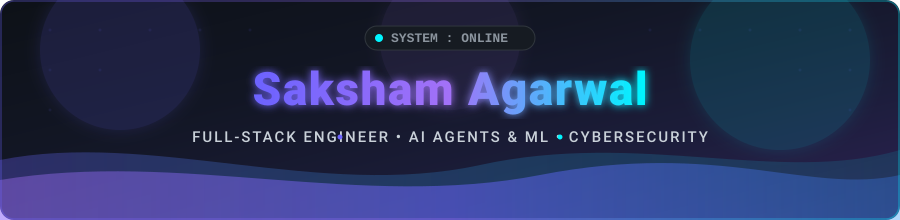

<div align="center">

<!-- HERO BANNER -->
<a href="https://github.com/saksham-dev07">
  
</a>

<!-- TYPING SVG ANIMATION -->
<a href="https://git.io/typing-svg">
  
</a>

<br/>

<!-- QUICK NAVIGATION -->
<p align="center">
  <a href="#-about-me"><b>About Me</b></a> &ensp;•&ensp;
  <a href="#-tech-stack"><b>Tech Stack</b></a> &ensp;•&ensp;
  <a href="#-featured-projects"><b>Featured Projects</b></a> &ensp;•&ensp;
  <a href="#-github-analytics"><b>GitHub Analytics</b></a> &ensp;•&ensp;
  <a href="#-contribution-snake"><b>Contributions</b></a> &ensp;•&ensp;
  <a href="#-connect-with-me"><b>Connect</b></a>
</p>

<!-- BADGES & METRICS -->
<p align="center">
  <a href="https://github.com/saksham-dev07"></a>
  &ensp;•&ensp;
  <a href="https://github.com/saksham-dev07?tab=followers"></a>
  &ensp;•&ensp;
  <a href="https://github.com/saksham-dev07?tab=repositories"></a>
  &ensp;•&ensp;
  <a href="https://github.com/saksham-dev07"></a>
  &ensp;•&ensp;
  <a href="https://visitorbadge.io/status?path=saksham-dev07.saksham-dev07"></a>
</p>

</div>


<!-- ABOUT ME SECTION -->
<div id="-about-me">
  <h2 align="center">👨‍💻 About Me</h2>
</div>

```yaml
developer:
  name: Saksham Agarwal
  origin: India 🇮🇳
  role: Full-Stack Engineer & Autonomous AI / ML Researcher
  core_philosophy: "First, solve the problem. Then, write elegant, performant code."

current_endeavors:
  active_projects:
    - Eco-Loop Building Agents: "Multi-agent autonomous energy optimization via Model Context Protocol (MCP)"
    - SentinelScrape: "Autonomous self-healing market radar & AI compute scraper"
    - NexusBoard: "Real-time collaborative infinite canvas & whiteboard engine"
    - BlockForge: "Ultra-fast browser ad & tracker blocker built on Manifest V3"
    - Deepfake Forensics: "Interpretable deepfake detection using Explainable AI (XAI)"
    - Last-Mile Delivery: "Logistics tracking system powered by FastAPI, React & Leaflet"
    - ExpenseLens: "AI-driven OCR receipt scanning and automated expense analytics"

domains_of_interest:
  - Autonomous Multi-Agent Systems & Model Context Protocol (MCP)
  - Deep Learning, Computer Vision & Explainable AI (XAI)
  - Real-Time Full-Stack Applications, WebSockets & Distributed Systems
  - Cloud Infrastructure, DevOps & Containerization
  - Cybersecurity, Threat Analysis & Binary Forensics

fun_fact: "Built a real-time Hand-Gesture Controlled Ping Pong game powered by OpenCV 🏓"
```

<br/>

<div align="center">
  <table>
    <tr>
      <td align="center" width="25%">
        
      </td>
      <td align="center" width="25%">
        
      </td>
      <td align="center" width="25%">
        
      </td>
      <td align="center" width="25%">
        
      </td>
    </tr>
  </table>
</div>


<!-- TECH STACK SECTION -->
<div id="-tech-stack">
  <h2 align="center">🛠️ Tech Stack & Skills</h2>
</div>

<div align="center">

<table width="100%">
  <tr>
    <td width="50%" valign="top">
      <h3 align="center">💻 Languages</h3>
      <p align="center">
        <a href="https://skillicons.dev">
          
        </a>
      </p>
    </td>
    <td width="50%" valign="top">
      <h3 align="center">⚛️ Frontend & Frameworks</h3>
      <p align="center">
        <a href="https://skillicons.dev">
          
        </a>
      </p>
    </td>
  </tr>
  <tr>
    <td width="50%" valign="top">
      <h3 align="center">🛠️ Backend & Databases</h3>
      <p align="center">
        <a href="https://skillicons.dev">
          
        </a>
        <br/>
        
        
      </p>
    </td>
    <td width="50%" valign="top">
      <h3 align="center">🤖 AI / ML & Agentic Systems</h3>
      <p align="center">
        <a href="https://skillicons.dev">
          
        </a>
        <br/>
        
        
        
        
      </p>
    </td>
  </tr>
  <tr>
    <td width="50%" valign="top">
      <h3 align="center">☁️ Cloud, DevOps & Systems</h3>
      <p align="center">
        <a href="https://skillicons.dev">
          
        </a>
      </p>
    </td>
    <td width="50%" valign="top">
      <h3 align="center">🔒 Security & Developer Tools</h3>
      <p align="center">
        <a href="https://skillicons.dev">
          
        </a>
        <br/>
        
        
      </p>
    </td>
  </tr>
</table>

</div>


<!-- FEATURED PROJECTS SECTION -->
<div id="-featured-projects">
  <h2 align="center">🌟 Featured Projects</h2>
</div>

<div align="center">

### 🤖 Autonomous AI, Agentic Systems & Computer Vision

| Project | Description | Tech Stack | Repository |
| :--- | :--- | :--- | :---: |
| **🌿 Eco-Loop Building Agents** | Autonomous Multi-Agent environmental & energy optimization system utilizing **Model Context Protocol (MCP)** and building simulation engines. | `Python` `MCP` `Multi-Agent AI` `EnergyPlus` | [**Code →**](https://github.com/saksham-dev07/Eco-Loop-Building-Agents) |
| **🔍 Deepfake Forensics** | State-of-the-art Deepfake detection framework integrating Explainable AI (XAI) for transparent facial artifact analysis. | `Python` `PyTorch` `XAI` `OpenCV` | [**Code →**](https://github.com/saksham-dev07/Deepfake-Forensics-with-Explainable-AI) |
| **🧠 NL App Compiler** | Natural Language to full application compiler translating prompt descriptions directly into structured code. | `JavaScript` `AI / LLM` `Node.js` | [**Code →**](https://github.com/saksham-dev07/NL-App-Compiler) |
| **📖 AI Story Generator** | Interactive creative narrative generation engine with prompt tuning and branching storyline synthesis. | `JavaScript` `AI` `Prompt Eng` | [**Code →**](https://github.com/saksham-dev07/AI-Story-Generator) |
| **🏓 Gesture Ping Pong** | Real-time computer vision interactive game driven completely by hand gesture motion tracking. | `Python` `OpenCV` `CVZone` | [**Code →**](https://github.com/saksham-dev07/Hand-Gesture-Controlled-Ping-Pong-Game-main) |
| **🏥 CKD Classification** | Predictive machine learning classification model for early diagnosis of Chronic Kidney Disease. | `Python` `Scikit-Learn` `Jupyter` | [**Code →**](https://github.com/saksham-dev07/Chronic-Kidney-Disease-Classification) |

### 🛡️ Cybersecurity, Automation & System Software

| Project | Description | Tech Stack | Repository |
| :--- | :--- | :--- | :---: |
| **🛡️ SentinelScrape** | Autonomous self-healing AI web scraping radar with real-time DOM anomaly sentinel & zero-downtime loop (Bright Data Hackathon). | `TypeScript` `AI Radar` `Bright Data` `Automation` | [**Code →**](https://github.com/saksham-dev07/Into-the-Scrape-Verse) |
| **🛡️ BlockForge** | Advanced browser ad & tracker blocker extension built for ultra-fast filtering and zero telemetry leakage. | `JavaScript` `Chrome APIs` `Manifest V3` | [**Code →**](https://github.com/saksham-dev07/Blockforge-Ad-Block-Extension-) |
| **🦠 Malware Detector** | Automated malware inspection tool leveraging signature-based YARA rules and heuristic behavioral analysis. | `YARA` `Python` `Security Forensics` | [**Code →**](https://github.com/saksham-dev07/Malware-Detector) |
| **⚡ C++ Systems & Projects** | High-performance C++ applications, CLI tools, mathematical engines, and algorithmic problem solvers. | `C++20` `OOP` `Algorithms` `CLI Systems` | [**Code →**](https://github.com/saksham-dev07/Cpp-projects) |

### 🌐 Real-Time Full-Stack Web & Smart Utilities

| Project | Description | Tech Stack | Repository |
| :--- | :--- | :--- | :---: |
| **🎨 NexusBoard** | Real-time collaborative infinite canvas & whiteboard engine featuring live multi-user sync and high-performance drawing. | `React 18` `Tailwind CSS` `WebSockets` `Canvas API` | [**Code →**](https://github.com/saksham-dev07/NexusBoard) |
| **🚚 Last-Mile Delivery Tracker** | Full-stack logistics routing and real-time delivery tracking platform with dynamic ETA computation and interactive maps. | `Python` `FastAPI` `React` `Leaflet / Maps` | [**Code →**](https://github.com/saksham-dev07/Last-Mile-Delivery-Tracker) |
| **🧾 ExpenseLens** | Advanced full-stack OCR receipt scanner leveraging AI to automatically parse, categorize, and analyze financial receipts. | `Python` `Tesseract OCR` `FastAPI` `React` | [**Code →**](https://github.com/saksham-dev07/ExpenseLens) |
| **📝 Docpilot** | Intelligent document processor for automated metadata extraction, categorization, and workflow acceleration. | `TypeScript` `React` `Node.js` | [**Code →**](https://github.com/saksham-dev07/Docpilot) |
| **🛒 E-Commerce Platform** | Full-scale modern e-commerce storefront with catalog filtering, cart state management, and checkout flows. | `TypeScript` `React` `Tailwind CSS` | [**Code →**](https://github.com/saksham-dev07/E-Commerce-Platform) |

</div>


<!-- GITHUB ANALYTICS & STATS -->
<div id="-github-analytics">
  <h2 align="center">📊 GitHub Analytics</h2>
</div>

<div align="center">

<table>
  <tr>
    <td width="50%" align="center">
      <a href="https://github.com/saksham-dev07">
        <picture>
          <source media="(prefers-color-scheme: dark)" srcset="https://github-readme-stats.anuraghazra1.vercel.app/api?username=saksham-dev07&show_icons=true&hide_border=true&bg_color=0d1117&title_color=6c63ff&icon_color=6c63ff&text_color=c9d1d9&include_all_commits=true&count_private=true" />
          
        </picture>
      </a>
    </td>
    <td width="50%" align="center">
      <a href="https://github.com/saksham-dev07">
        <picture>
          <source media="(prefers-color-scheme: dark)" srcset="https://streak-stats.demolab.com?user=saksham-dev07&hide_border=true&background=0D1117&ring=6C63FF&fire=6C63FF&currStreakLabel=6C63FF&sideLabels=C9D1D9&currStreakNum=C9D1D9&dates=8B949E&sideNums=C9D1D9" />
          
        </picture>
      </a>
    </td>
  </tr>
  <tr>
    <td colspan="2" align="center">
      <br/>
      <a href="https://github.com/saksham-dev07">
        
      </a>
    </td>
  </tr>
</table>

</div>


<!-- CONTRIBUTION SNAKE -->
<div id="-contribution-snake" align="center">
  <h2>🕹️ Contribution Activity &amp; Snake</h2>
  <p><i>Interactive visualization of my daily commit matrix and development journey</i></p>
</div>

<div align="center">
  <table width="100%" style="max-width: 900px;">
    <!-- Terminal Titlebar -->
    <tr>
      <td bgcolor="#161b22" style="border-top-left-radius: 8px; border-top-right-radius: 8px; padding: 10px 14px; border: 1px solid #30363d; border-bottom: none;">
        <span style="color: #ff5f56; font-size: 13px;">●</span>&nbsp;<span style="color: #ffbd2e; font-size: 13px;">●</span>&nbsp;<span style="color: #27c93f; font-size: 13px;">●</span>
        &ensp;&ensp;
        <code style="color: #8b949e; font-size: 12px; font-family: monospace;">saksham@github:~/contributions$ snk --palette=tokyonight-purple</code>
      </td>
    </tr>
    <!-- Terminal Body -->
    <tr>
      <td bgcolor="#0d1117" align="center" style="border-bottom-left-radius: 8px; border-bottom-right-radius: 8px; padding: 16px; border: 1px solid #30363d;">
        <a href="https://github.com/saksham-dev07">
          <picture>
            <source media="(prefers-color-scheme: dark)" srcset="https://raw.githubusercontent.com/saksham-dev07/saksham-dev07/output/github-snake-dark.svg" />
            <source media="(prefers-color-scheme: light)" srcset="https://raw.githubusercontent.com/saksham-dev07/saksham-dev07/output/github-snake.svg" />
            
          </picture>
        </a>
      </td>
    </tr>
  </table>

  <br/>

  <p align="center">
    
    &ensp;
    
    &ensp;
    
  </p>
</div>


<!-- DEV HUMOR & INSPIRATION -->
<div align="center">
  <table border="0">
    <tr>
      <td align="center" width="50%">
        <a href="https://github.com/saksham-dev07">
          
        </a>
      </td>
      <td align="center" width="50%">
        <a href="https://github.com/saksham-dev07">
          
        </a>
      </td>
    </tr>
  </table>
</div>


<!-- CONNECT WITH ME -->
<div id="-connect-with-me">
  <h2 align="center">📬 Connect With Me</h2>
</div>

<div align="center">

<p align="center">
  <i>"Let's build something exceptional together — feel free to reach out for collaborations, discussions, or opportunities!"</i>
</p>

<p align="center">
  <a href="https://github.com/saksham-dev07" target="_blank">
    
  </a>
  &nbsp;
  <a href="https://www.linkedin.com/in/saksham-agarwal-b44910289/" target="_blank">
    
  </a>
  &nbsp;
  <a href="https://sakshamdev-portfolio.vercel.app/" target="_blank">
    
  </a>
  &nbsp;
  <a href="mailto:sakmmm07@gmail.com" target="_blank">
    
  </a>
</p>

<br/>

<!-- FOOTER BANNER -->
<a href="#">
  
</a>

<p align="center">
  <sub>⭐️ Designed &amp; Crafted with passion by <b>Saksham Agarwal</b> | &copy; 2026</sub>
</p>

</div>
